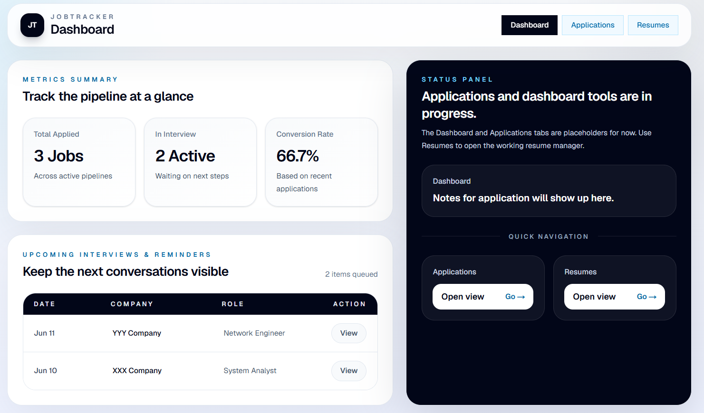
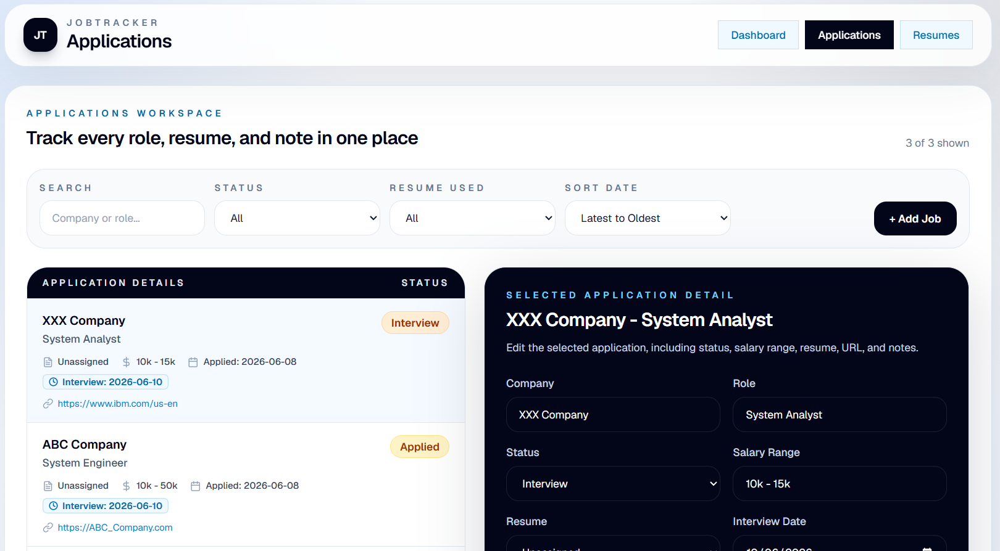
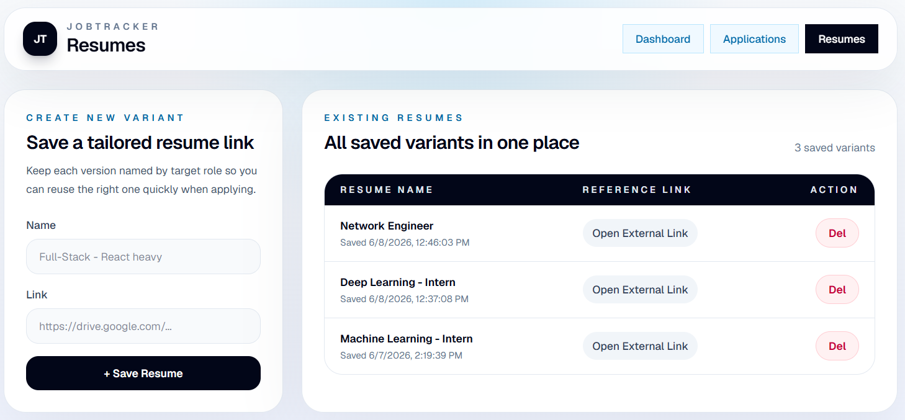

# Job Tracker
A web application that used to manage resumes, track job applications, and monitor interview progress.

## Overview
Job Tracker is a personal job application management system designed for job seekers to organize resumes, track applications, manage interview schedules, and monitor application status.

This project was developed as a side project to practice full-stack web development using Next.js and SQLite.







## Features

- Dashboard
  - Total applications
  - Recent activities

- Job Application Tracking
  - Track application status
  - Store company information
  - Record application dates

- Search & Filter
  - Filter by status
  - Search by company

- Resume Management
  - Create resumes
  - Update resumes
  - Delete resumes

## Tech Stack

### Frontend
- Next.js 
- React
- Tailwind CSS

### Backend
- Next.js

### Database
- SQLite
- Better SQLite3

### Tools
- Git
- GitHub

## Installation

Clone repository

```bash
git clone https://github.com/yuxiang31/job-tracker.git 
```

Install Dependencies
```
npm install
```
```
npm run db:init
```
```
npm run dev
```
